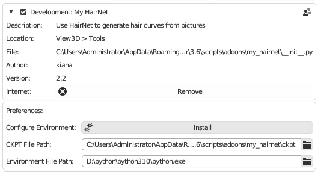
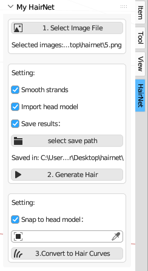
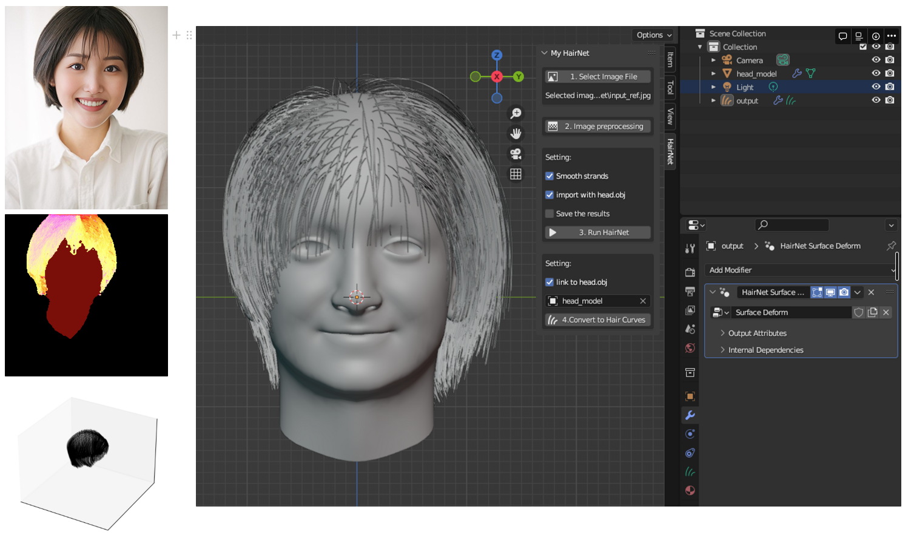
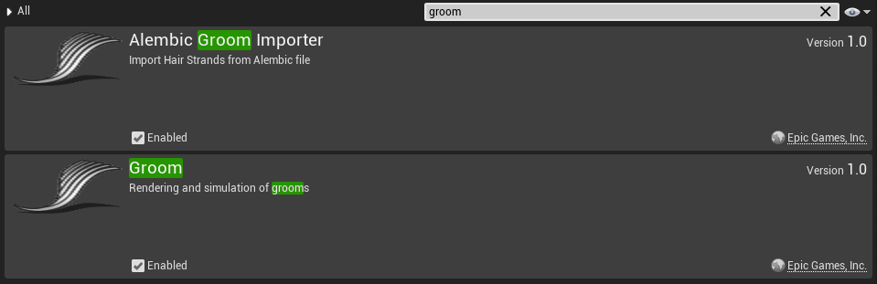
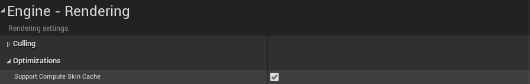
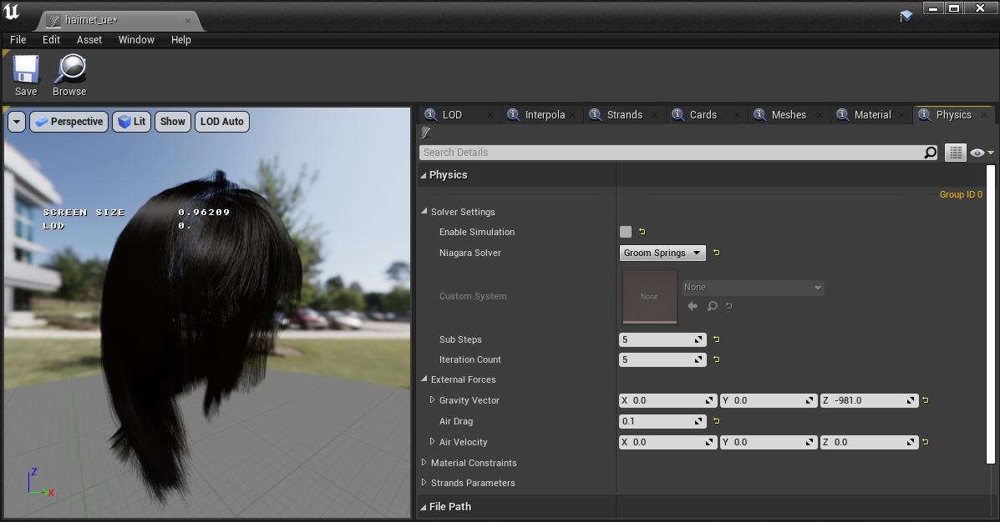

# HairNet2Curves
A Blender add-on that can generate Blender curves based on a single hairstyle image.


This repository contains code to predict hair curves from a single image. Network frameworks from the paper: [HairNet: Single-View Hair Reconstruction using Convolutional Neural Networks](https://arxiv.org/abs/1806.07467).

## **Initial Setup**

1. **Install Python**
    
    The plugin requires Python to run. Make sure Python is installed on your system.
    
    You can use the command **`where Python`** to find the location of **`python.exe`** on your system (press Win+R to open the Run dialog, enter **`cmd`** to open the command line, then enter **`where Python`**). If you already have Python installed, you can skip this step. Otherwise, click **[here](https://www.python.org/downloads/)** to download and install Python.
    
    > 💡 This plugin only supports Python 2.7.9+ or Python 3.4+ versions.

    > 💡  During installation, make sure to select the "Add Python to PATH" option.

    
2. **Install the Plugin**
    
    Install the plugin using the standard Blender plugin installation method: go to **Edit → Preferences → Add-ons → Install...** and select the plugin zip file. Click "Install Add-on" to complete the installation. Finally, enable the **HairNet2Curves_v2.2** plugin in the plugin interface.
    
3. **Install Dependencies**
    
    After installing the plugin, please click on "Install" in the plugin preferences interface. The plugin will automatically install the required dependencies for running. You can open the console panel beforehand by going to **Windows → Toggle System Console**, and then observe the installation progress in the console.

    
    
    
    > 💡 If you install the environment using this method,  you **do not need to change** any settings in the plugin preferences. For other installation methods, refer to the [**Advanced Installation**](#advanced-installation) section.
    
 
## **Usage Steps**

To start using the plugin, bring up the HairNet panel in the right sidebar of the 3D viewport.



1. **Select Image:** Click to select a real hairstyle image, and the path of the currently selected image will be displayed in the panel.
    
    > 💡 There is an `input_ref.png` in the plug-in folder that can be used for testing.
    
2. **Generate Hair:**
    - Settings:
        - ***Smooth Hair:*** The hair generated by the network may have slight jitter. Select this option to apply smoothing post-processing to the hair strands.
        - ***Import Standard Bust Model:*** Import the **`head_model.obj`** along with the hair strands (this model was used for training and ensures that the hair strands fit the scalp surface).
        - ***Save Results:*** Select this option and choose a save path. The hair model file (**`.obj`**) and a preview image of the hair (**`.png`**) will be saved to the selected file path. Deselect this option if you don't want to save the results.
    - Generate Hair: After the prediction, the hair mesh will be imported into Blender.

3. **Convert to Curves:** Click to convert the mesh hair strands into curve hair and automatically add the **`Surface Deform`** geometry modifier. The converted hair can be further sculpted, geometric nodes added, etc.



## **Advanced Installation**

In addition to clicking the `Install` button in the [**Preferences**](#initial-setup), you can also choose one of the following ways to install the environment.

1. via conda：
    
    Requires `Anaconda` 
    
    ```bash
    conda env create -f setup/environment.yml   conda activate hairnet
    ```
    
2. via pip： 
    
    ```bash
    pip install -r setup/requirements.txt
    ```
    
3. via manual installation： 
    
    ```bash
    pip install tensorflow==2.8.0 
    pip install imageio 
    pip install protobuf==3.19.0 
    pip install matplotlib 
    pip install opencv-python 
    pip install torch==1.12.1+cpu torchvision==0.13.1+cpu -f https://download.pytorch.org/whl/torch_stable.html
    ```
    

## **Practical Application**
Here are the specific steps and application effects of using Blender HairNet-generated hair in UE:

1. Apply the geometry node modifier used in the hair model to preserve the modified hairstyle.
2. Select the current hair strand model, go to **Object → Convert → Particle System** to convert the current curves hair strands to particle type.
3. Select the scalp object, modify the particle **properties → Render → uncheck "Show Emitter"**.
4. Export as Alembic (.abc) file, set the start and end frames to 1, and select **"Selected Objects"** before exporting.
5. UE settings:
    - Plugin settings: **Edit → Plugins** → Enable the **Groom** and **Alembic Groom Import** plugins.
        
        
        
    - Project settings: **Edit → Project Settings → Engine → Rendering → Optimization → Check "Support Compute Skincache"**.
        
        
        
6. Import the Alembic file into the Content Browser and add a new level to place the hair and bust model.
    
7. Hair physics simulation in UE:
    * Double-click to open the imported hair. In the Physics panel, under Solver Settings, check **"Enable Simulation"** and select the default Niagara solver. At this point, you can see the simulation effect when moving the hair. Further adjust external forces, material constraints parameters to achieve the best physical simulation effect.
        
        
        
    * Bind to an animated skeletal mesh:
        - Bind the bust model to a skeleton in Blender, export it as an FBX file, import it into UE as a "Skeletal Mesh", place it in the scene, and create a binding asset for the skeletal mesh.
        - In the Details panel, select Add Component to add the Groom attribute to the skeletal mesh and connect the hair strands, skeletal mesh, and binding asset to the Groom slot under that attribute. Once done, you will have an interactive groom that can be used with the animated connected skeletal mesh.
    
    The final hair simulation result imported into UE is shown below:
    
